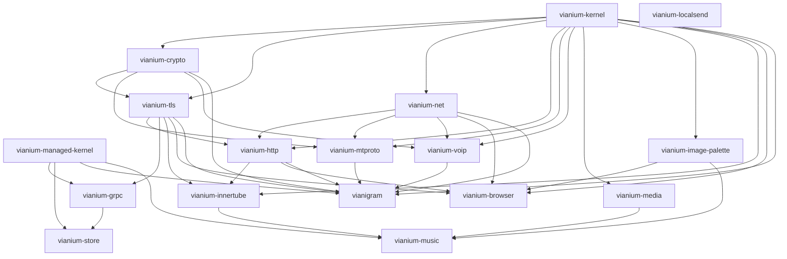

# Vianium Multi-Repo Migration Plan

| Field | Value |
|---|---|
| Document version | 0.2.0 |
| Last updated | 2026-05-18 |
| Author | Angel Careaga <hello@angelcareaga.com> |
| Status | Phase 0 complete locally; Phase 1 ready to start |

## Strategic Context

Vianigram (a Telegram client for Windows Phone 8.1) and VianiumBrowser (a
from-scratch web browser for the same platform) are currently developed as
two coupled working trees under `D:\Projects\2026\WP\`. VianiumBrowser
provides reusable infrastructure (kernel, TLS, networking, HTTP) consumed
by Vianigram via relative project references. This setup works for solo
development but does not scale to public visibility, third-party reuse, or
durable author attribution.

This migration extracts shared infrastructure into independent public
repositories under the `vianium` GitHub organization, with each product
(`vianium-browser`, `vianigram`) becoming a focused consumer repo. The work
is additive: original working trees remain intact and buildable until the
final cutover phase.

The migration pursues three outcomes:

1. **Reusable infrastructure** that other developers can adopt without
   inheriting the entire product (Apache 2.0 maximizes reach).
2. **Durable author attribution** that survives forks and time, via NOTICE
   files and SPDX headers embedded in every source file.
3. **Product protection** against commercial repackaging or resale, via
   PolyForm Noncommercial 1.0.0 on final products.

## Operating Constraints

The migration must be additive and non-destructive.

Do not modify these original working trees during the migration unless a
later phase explicitly says so:

- `D:\Projects\2026\WP\Vianigram`
- `D:\Projects\2026\WP\VianiumBrowser`

All new work happens under:

- `D:\Projects\2026\VianiumProject`

## Decisions on Record

| Decision | Value |
|---|---|
| GitHub organization | `https://github.com/vianium` (created, Free plan) |
| Founding author | Angel Careaga |
| Public author email | `hello@angelcareaga.com` |
| Secondary developer email | `dev.angelcareaga@gmail.com` |
| GitHub user | `https://github.com/AngelCareaga` |
| Personal domain | `angelcareaga.com` |
| Copyright year | 2026 |
| Initial version | `v0.1.0` |
| Import strategy | Clean initial import per repo; no `git filter-repo` |
| Sole author at v0.1.0 | Yes (Angel Careaga only in AUTHORS.md) |
| Repo strategy | Multi-repo, not monorepo |
| Vianigram naming | Keep product name `vianigram`; do not rename internal `Vianigram.*` projects or namespaces |
| Cross-repo integration | Sibling-directory project references (same pattern as current setup) |
| Ecosystem scope | 18 repos: 7 Tier 1, 6 Tier 2, 3 Tier 3, 2 Meta |
| VianiumMusic inclusion | Yes — extracted libs (`vianium-media`, `vianium-image-palette`, `vianium-innertube`) become Tier 2; product becomes Tier 3 `vianium-music` |
| Firestore SDK inclusion | Yes — `PivoraStore` renamed to `vianium-store` (generic name for future pluggable backends like Cosmos, Supabase) |
| Managed TLS strategy | Discarded `PivoraTLS`. C# consumers reach native `vianium-tls` via WinRT projection. See ADR-0004 in `vianium-docs/adr/0004-native-tls-winrt-projection.md` |
| NuGet publishing | `vianium-store` publishes to NuGet at v0.1.0 (existing `.nuspec` preserved). Others added later. |
| Pre-publish refactor | `vianium-store` transport adapter switches from `PivoraTLS` to `vianium-tls` WinRT before v0.1.0 push (~2 days focused work). |
| Other Pivora\* projects | Mostly out of scope. The following are migrated: `PivoraStore` → `vianium-store`, `PivoraRPC` → `vianium-grpc`, `PivoraLocalSend` → `vianium-localsend`. The remaining ~17 `Pivora*` working trees stay where they are. |
| LocalSend client inclusion | Yes — `PivoraLocalSend` (already shipped to WP Store as v1.0.0/v1.0.1) becomes `vianium-localsend`. Standalone, no sibling deps in v0.1.0. LocalSend protocol (MIT) attribution preserved in `TRADEMARKS.md`. |

## License Rationale

The ecosystem uses two licenses, applied by tier.

### Apache License 2.0 — Tier 1 (Foundation) and Tier 2 (Domain Protocols)

Applied to: `vianium-kernel`, `vianium-crypto`, `vianium-tls`,
`vianium-net`, `vianium-http`, `vianium-mtproto`, `vianium-voip`.

What it permits anyone to do:

- Use the code freely, including for commercial purposes.
- Modify and create derivative works.
- Redistribute in source or binary form, with or without modifications.
- Sublicense and incorporate into proprietary software.

What it requires of users:

- Include a copy of the license in any redistribution.
- Preserve copyright, patent, trademark, and attribution notices,
  including the `NOTICE` file when present.
- Mark modified files as modified.

What it explicitly forbids:

- Using the author's name or "Vianium" to endorse derivative products
  without permission (trademark clause).

Patent grant: contributors grant a perpetual, irrevocable patent license
covering claims their contributions infringe. If a user sues over a patent
covering the code, their license terminates automatically.

Why this fits Tier 1 and Tier 2: foundation and protocol libraries achieve
their goal — durable author attribution — by being adopted widely,
including by commercial consumers. The Apache 2.0 NOTICE requirement
guarantees that attribution travels with the code into any project that
uses it.

### PolyForm Noncommercial 1.0.0 — Tier 3 (Products)

Applied to: `vianium-browser`, `vianigram`.

What it permits anyone to do:

- Use the software for any noncommercial purpose, including personal use,
  research, study, hobbies, charitable use, educational use, and
  governmental use.
- Modify the software.
- Redistribute the software under the same license, with the same
  noncommercial restriction.

What it forbids:

- Any commercial use, defined as use "intended for or directed toward
  commercial advantage or monetary compensation." This includes selling
  the software, offering it as a paid service, including it in a
  commercial product, or using it internally inside a for-profit company.
- Removing or altering license or copyright notices.

Patent grant: same protective mechanism as Apache 2.0; patent litigation
terminates the license.

Important caveat: this is source-available, not open source in the OSI
sense. The Open Source Initiative definition prohibits restricting fields
of use, including commercial. PolyForm Noncommercial is therefore
correctly described as "source-available" or "fair-code." All
public-facing descriptions of Tier 3 products should use that phrasing
instead of "open source."

Why this fits Tier 3: final products are where commercial repackagers
could most easily harm the project, by forking and reselling. PolyForm
Noncommercial preserves user access while blocking resale. A commercial
license remains available on request from the author.

### License Comparison

| Aspect | Apache 2.0 (Tier 1+2) | PolyForm-NC 1.0.0 (Tier 3) |
|---|---|---|
| Personal use | Allowed | Allowed |
| Commercial use | Allowed | Not allowed |
| Modification | Allowed | Allowed |
| Redistribution | Allowed | Allowed (noncommercial only) |
| Commercial forks | Allowed | Not allowed |
| Required attribution | Yes (NOTICE) | Yes |
| OSI-approved | Yes | No (source-available) |
| Patent grant | Yes | Yes |
| Strength of resale protection | Limited | Strong |
| Author-name propagation reach | Maximum | Moderate |

### Attribution mechanism

Three layers ensure attribution survives forks and time:

1. **`NOTICE` file** in the repo root. Apache 2.0 makes this legally
   binding for derivative works that redistribute the code.
2. **`AUTHORS.md`** lists Angel Careaga as founding author and any future
   contributors.
3. **SPDX header in every source file** identifying license and copyright.

## Licensing Policy

This section captures the operational requirements derived from the
[License Rationale](#license-rationale) above.

### Tier-to-license assignment

| Tier | Repos | License |
|---|---|---|
| Tier 1 - Foundation | `vianium-kernel`, `vianium-managed-kernel`, `vianium-crypto`, `vianium-tls`, `vianium-net`, `vianium-http`, `vianium-grpc` | Apache-2.0 |
| Tier 2 - Domain protocols and libraries | `vianium-mtproto`, `vianium-mtproxy`, `vianium-voip`, `vianium-media`, `vianium-image-palette`, `vianium-innertube`, `vianium-store` | Apache-2.0 |
| Tier 3 - Products | `vianium-browser`, `vianigram`, `vianium-music`, `vianium-localsend` | PolyForm-Noncommercial-1.0.0 |
| Meta | `.github`, `vianium-docs` | Apache-2.0 unless a specific file says otherwise |

### Required files in every repo

- `LICENSE` (full text of the assigned license)
- `NOTICE` (attribution)
- `AUTHORS.md` (founding author and contributors)
- `README.md`
- `CONTRIBUTING.md` (DCO sign-off required)
- `CODE_OF_CONDUCT.md`
- `SECURITY.md`
- `.gitignore`
- `.gitattributes`
- `.editorconfig`

### Additional files if the repo vendors third-party code

- `THIRD_PARTY_NOTICES.md` (catalog with license per upstream component)
- `LICENSES/` (full text of each upstream license)

### Source file headers

Every source file (`.cpp`, `.h`, `.cs`, `.ps1`) must begin with an SPDX
header. The `tools\Add-SpdxHeaders.ps1` script applies these headers in
bulk.

Tier 1 and Tier 2:

```cpp
// SPDX-License-Identifier: Apache-2.0
// SPDX-FileCopyrightText: 2026 Angel Careaga <hello@angelcareaga.com>
```

Tier 3:

```cpp
// SPDX-License-Identifier: PolyForm-Noncommercial-1.0.0
// SPDX-FileCopyrightText: 2026 Angel Careaga <hello@angelcareaga.com>
```

## Target Local Layout

```text
D:\Projects\2026\VianiumProject\
|
|-- .github\                  repo: vianium/.github
|-- vianium-docs\             repo: vianium/vianium-docs
|
|   ── Tier 1 — Foundation (Apache 2.0) ──
|-- vianium-kernel\           repo: vianium/vianium-kernel
|-- vianium-managed-kernel\   repo: vianium/vianium-managed-kernel
|-- vianium-crypto\           repo: vianium/vianium-crypto
|-- vianium-tls\              repo: vianium/vianium-tls
|-- vianium-net\              repo: vianium/vianium-net
|-- vianium-http\             repo: vianium/vianium-http
|-- vianium-grpc\             repo: vianium/vianium-grpc
|
|   ── Tier 2 — Domain (Apache 2.0) ──
|-- vianium-mtproto\          repo: vianium/vianium-mtproto
|-- vianium-mtproxy\          repo: vianium/vianium-mtproxy
|-- vianium-voip\             repo: vianium/vianium-voip
|-- vianium-media\            repo: vianium/vianium-media
|-- vianium-image-palette\    repo: vianium/vianium-image-palette
|-- vianium-innertube\        repo: vianium/vianium-innertube
|-- vianium-store\            repo: vianium/vianium-store
|
|   ── Tier 3 — Products (PolyForm Noncommercial 1.0.0) ──
|-- vianium-browser\          repo: vianium/vianium-browser
|-- vianigram\                repo: vianium/vianigram
|-- vianium-music\            repo: vianium/vianium-music
|-- vianium-localsend\        repo: vianium/vianium-localsend
|
|-- templates\
|-- tools\
`-- MIGRATION_PLAN.md
```

## Code Mapping: Sources to Destinations

This table consolidates the per-phase source/destination mappings into a
single reference. Each row is reapplied by the relevant phase under
[Phase Plan](#phase-0---preparation).

| Origin (current working tree) | Destination (under `VianiumProject\`) | Phase |
|---|---|---|
| `WP\VianiumBrowser\Core\Vianium.Core.Kernel\` | `vianium-kernel\` | 2.1 |
| `WP\VianiumBrowser\Core\Vianium.Core.Tls\src\crypto\` | `vianium-crypto\src\` (public headers under `include\vianium\crypto\`) | 2.2 |
| `WP\VianiumBrowser\Core\Vianium.Core.Tls\` (without `src\crypto\`) | `vianium-tls\` | 2.3 |
| `WP\VianiumBrowser\Core\Vianium.Core.Net\` | `vianium-net\` | 2.4 |
| `WP\VianiumBrowser\Core\Vianium.Core.Http\` | `vianium-http\` | 2.5 |
| `WP\VianiumBrowser\Core\Vianium.Core.{Dom,Css,JsRt,Layout,Wasm,WebEngine,ExtSandbox}\` | `vianium-browser\Core\` | 4.1 |
| `WP\VianiumBrowser\Core\Vianium.Browser.*\` | `vianium-browser\Core\` | 4.1 |
| `WP\VianiumBrowser\Clients\` | `vianium-browser\Clients\` | 4.1 |
| `WP\Vianigram\Core\Vianigram.Core.Tl\` | `vianium-mtproto\src\tl\` | 3.1 |
| `WP\Vianigram\Core\Vianigram.Core.MTProto\` | `vianium-mtproto\src\mtproto\` | 3.1 |
| `WP\Vianigram\Core\Vianigram.Core.Crypto\` | Concept deleted; consumers reference `vianium-crypto` directly | 3.1, 4.2 |
| `WP\Vianigram\Core\VianiumVoIP\` | `vianium-voip\src\voip\` | 3.2 |
| `WP\Vianigram\Core\Vianium.Tgcalls\` | `vianium-voip\src\tgcalls\` | 3.2 |
| `WP\Vianigram\Core\libtgvoip\` | `vianium-voip\third_party\libtgvoip\` (vendored, BSD-3 preserved) | 3.2 |
| `WP\Vianigram\Core\Vianigram.{Account,Chats,Messages,Calls,Contacts,Media,Sync,SecretChats,Stickers,Notifications,Settings,Search,Privacy,Storage,ViewModels}\` | `vianigram\Core\` (names preserved) | 4.2 |
| `WP\Vianigram\Core\Vianigram.Composition\` | `vianigram\Core\Vianigram.Composition\` | 4.2 |
| `WP\Vianigram\Core\Vianigram.Kernel\` (managed C#) | `vianigram\Core\Vianigram.Kernel\` (kept as-is; distinct from native `vianium-kernel`) | 4.2 |
| `WP\Vianigram\Clients\` | `vianigram\Clients\` | 4.2 |
| `WP\VianiumBrowser\Core\Vianium.Browser.Kernel\` | `vianium-managed-kernel\` | 2.6 |
| `WP\PivoraRPC\` | `vianium-grpc\` (namespaces renamed, TLS refactored) | 2.7 |
| `WP\VianiumMusic\Core\Vianium.Core.AudioDsp\` | `vianium-media\src\audio_dsp\` | 3.3 |
| `WP\VianiumMusic\Core\Vianium.Core.TagParser\` | `vianium-media\src\tag_parser\` | 3.3 |
| `WP\VianiumMusic\Core\Vianium.Core.FFmpegInterop\` | `vianium-media\src\ffmpeg_interop\` | 3.3 |
| `WP\VianiumMusic\_external\ffmpeg-src\` | `vianium-media\third_party\ffmpeg\` (LGPL sources only, no bins) | 3.3 |
| `WP\VianiumMusic\Core\Vianium.Core.ImagePalette\` | `vianium-image-palette\` | 3.4 |
| `WP\VianiumMusic\Core\Vianium.Core.Innertube\` | `vianium-innertube\` | 3.5 |
| `WP\PivoraStore\src\PivoraStore\` | `vianium-store\src\Vianium.Store\` (namespaces renamed, TLS refactored) | 3.6 |
| `WP\PivoraStore\samples\TodoApp\` | `vianium-store\samples\TodoApp\` | 3.6 |
| `WP\PivoraStore\tests\PivoraStore.Tests\` | `vianium-store\tests\Vianium.Store.Tests\` | 3.6 |
| `WP\PivoraStore\PivoraStore.nuspec` | `vianium-store\Vianium.Store.nuspec` (metadata updated) | 3.6 |
| `WP\VianiumMusic\` (without extracted libs and FFmpeg externals) | `vianium-music\` | 4.3 |
| `WP\VianiumMusic\Core\Vianium.Music.{Composition,ViewModels,Shell,Playback,Library,Settings,Playlists,Downloads,BackgroundTask,Streaming,Search,Recommendations,Casting,Presence,Lyrics,Podcasts,EchoFind}\` | `vianium-music\Core\` (names preserved) | 4.3 |
| `WP\VianiumMusic\Core\Vianium.Music.LibraryIndex\` (music-specific) | `vianium-music\Core\Vianium.Music.LibraryIndex\` (stays in product) | 4.3 |
| `WP\VianiumMusic\Clients\` | `vianium-music\Clients\` | 4.3 |
| `WP\PivoraStoreNative\` | Discarded (was orphan native experiment; superseded by `vianium-tls` and the `vianium-store` C# SDK) | — |
| `WP\PivoraTLS\` | Discarded (functionality replaced by `vianium-tls` native + WinRT projection per ADR-0004) | — |
| `WP\PivoraTLSNative\` | Discarded (functionally is `vianium-tls`) | — |
| `WP\PivoraLocalSend\src\PivoraLocalSend\` | `vianium-localsend\src\Vianium.LocalSend\` (namespace renamed) | 4.4 |
| `WP\PivoraLocalSend\releases\1.0.0\` and `1.0.1\` | `vianium-localsend\releases\` (optional, after signing-info audit) | 4.4 |

The crypto extraction (Phase 2.2) and the deletion of
`Vianigram.Core.Crypto` are the only non-trivial structural changes. Every
other migration is a directory copy plus reference adjustment.

## Repository Dependency Graph



Arrow direction reads as "is used by." Example: `kernel --> crypto` means
that `vianium-crypto` consumes `vianium-kernel`. Foundation repos point
upward into the products that depend on them. Inversely, every arrow into
a node lists that node's direct dependencies.

## Phase 0 - Preparation

Status: Complete locally.

Goal:

Create reusable templates and scripts without moving product code.

Current files:

- `D:\Projects\2026\VianiumProject\README.md`
- `D:\Projects\2026\VianiumProject\templates\LICENSE-Apache-2.0.txt`
- `D:\Projects\2026\VianiumProject\templates\LICENSE-PolyForm-NC-1.0.0.txt`
- `D:\Projects\2026\VianiumProject\templates\NOTICE.template`
- `D:\Projects\2026\VianiumProject\templates\README.template.md`
- `D:\Projects\2026\VianiumProject\templates\SECURITY.md`
- `D:\Projects\2026\VianiumProject\templates\CONTRIBUTING.md`
- `D:\Projects\2026\VianiumProject\templates\CODE_OF_CONDUCT.md`
- `D:\Projects\2026\VianiumProject\templates\.gitignore`
- `D:\Projects\2026\VianiumProject\templates\.gitattributes`
- `D:\Projects\2026\VianiumProject\templates\.editorconfig`
- `D:\Projects\2026\VianiumProject\templates\spdx-header-cpp.txt`
- `D:\Projects\2026\VianiumProject\templates\spdx-header-cs.txt`
- `D:\Projects\2026\VianiumProject\templates\AUTHORS.template.md`
- `D:\Projects\2026\VianiumProject\templates\THIRD_PARTY_NOTICES.template.md`
- `D:\Projects\2026\VianiumProject\tools\Bootstrap-VianiumRepo.ps1`
- `D:\Projects\2026\VianiumProject\tools\Add-SpdxHeaders.ps1`
- `D:\Projects\2026\VianiumProject\tools\README.md`

Validation already performed:

- Apache license template matches the official Apache 2.0 text.
- PolyForm license template matches the official PolyForm source text.
- Templates are ASCII.
- Bootstrap script runs with `-WhatIf`.
- SPDX script runs with `-WhatIf`.

Useful commands:

```powershell
cd D:\Projects\2026\VianiumProject

.\tools\Bootstrap-VianiumRepo.ps1 `
  -Name vianium-kernel `
  -License Apache-2.0 `
  -Tier 1 `
  -WhatIf

.\tools\Bootstrap-VianiumRepo.ps1 `
  -Name vianigram `
  -License PolyForm-NC-1.0.0 `
  -Tier 3 `
  -WhatIf
```

Gate:

- The user approves templates and script behavior.

## Phase 1 - GitHub Organization and Meta Repos

Goal:

Make the public organization presentable before publishing code.

GitHub org:

- `vianium`

Create these repositories first:

- `vianium/.github`
- `vianium/vianium-docs`

### `.github` Repo

Local path:

- `D:\Projects\2026\VianiumProject\.github`

Contents:

```text
.github\
|-- profile\
|   `-- README.md
|-- ISSUE_TEMPLATE\
|   |-- bug_report.yml
|   |-- feature_request.yml
|   `-- config.yml
|-- PULL_REQUEST_TEMPLATE.md
|-- SECURITY.md
|-- CODE_OF_CONDUCT.md
`-- README.md
```

Profile README should explain:

- What Vianium is.
- That Angel Careaga is the founding author.
- The repo tiers.
- The licensing split.
- Links to `vianium-docs`, `vianium-kernel`, and future repos.

### `vianium-docs` Repo

Local path:

- `D:\Projects\2026\VianiumProject\vianium-docs`

Contents:

```text
vianium-docs\
|-- LICENSE
|-- NOTICE
|-- README.md
|-- AUTHORS.md
|-- contribution-guide.md
|-- licensing-policy.md
|-- architecture-overview.md
|-- getting-started.md
|-- adr\
|   |-- 0001-multi-repo.md
|   |-- 0002-dual-licensing.md
|   `-- 0003-vianigram-name.md
`-- design-system\
```

Use Apache-2.0 for docs unless a file says otherwise.

Bootstrap command:

```powershell
.\tools\Bootstrap-VianiumRepo.ps1 `
  -Name vianium-docs `
  -License Apache-2.0 `
  -Tier Meta `
  -InitializeGit
```

Gate:

- `github.com/vianium` has a readable public profile.
- `.github` and `vianium-docs` exist locally and on GitHub.
- Both have first commits.

## Phase 2 - Tier 1 Foundation Repositories

Goal:

Create and validate the reusable foundation libraries.

Order:

1. `vianium-kernel`
2. `vianium-crypto`
3. `vianium-tls` (native + WinRT projection)
4. `vianium-net`
5. `vianium-http`
6. `vianium-managed-kernel`
7. `vianium-grpc`

### 2.1 `vianium-kernel`

Source:

- `D:\Projects\2026\WP\VianiumBrowser\Core\Vianium.Core.Kernel`

Destination:

- `D:\Projects\2026\VianiumProject\vianium-kernel`

License:

- Apache-2.0

Steps:

1. Bootstrap repo.
2. Copy source tree, excluding build artifacts.
3. Add SPDX headers.
4. Create or keep `Vianium.Core.Kernel.vcxproj`.
5. Create minimal `Vianium.Core.Kernel.sln` if needed.
6. Build standalone.
7. Initialize Git and commit.

Command sketch:

```powershell
cd D:\Projects\2026\VianiumProject

.\tools\Bootstrap-VianiumRepo.ps1 `
  -Name vianium-kernel `
  -License Apache-2.0 `
  -Tier 1

robocopy `
  D:\Projects\2026\WP\VianiumBrowser\Core\Vianium.Core.Kernel `
  D:\Projects\2026\VianiumProject\vianium-kernel `
  /E /XD .vs ARM ARM64 Debug Release x64 x86 "Generated Files" bin obj `
  /XF *.obj *.pdb *.ilk *.idb *.tlog *.lastbuildstate *.VC.db

.\tools\Add-SpdxHeaders.ps1 `
  -Path D:\Projects\2026\VianiumProject\vianium-kernel `
  -License Apache-2.0
```

Gate:

- Builds independently.
- README describes API purpose.
- First commit exists.

### 2.2 `vianium-crypto`

Source:

- `D:\Projects\2026\WP\VianiumBrowser\Core\Vianium.Core.Tls\src\crypto`

Destination:

- `D:\Projects\2026\VianiumProject\vianium-crypto`

License:

- Apache-2.0

Expected content:

```text
vianium-crypto\
|-- include\
|   `-- vianium\
|       `-- crypto\
|-- src\
|   |-- sha1.*
|   |-- sha256.*
|   |-- sha512.*
|   |-- hmac.*
|   |-- aes_core.*
|   |-- aes_gcm.*
|   |-- bignum.*
|   `-- ecdh_p256.*
`-- Vianium.Core.Crypto.vcxproj
```

Steps:

1. Bootstrap repo.
2. Copy crypto source from TLS into `src`.
3. Decide which headers are public and move/copy them to `include\vianium\crypto`.
4. Create `Vianium.Core.Crypto.vcxproj` as a static library.
5. Reference `..\vianium-kernel\Vianium.Core.Kernel.vcxproj` (crypto types
   use kernel primitives like `Result<T>` and arena allocators).
6. Add SPDX headers.
7. Add README with algorithms and security disclaimer.
8. Build standalone.
9. Commit.

Gate:

- Builds independently.
- Public headers are clear.
- No crypto files remain duplicated inside migrated `vianium-tls` after Phase 2.3.

### 2.3 `vianium-tls`

Source:

- `D:\Projects\2026\WP\VianiumBrowser\Core\Vianium.Core.Tls`

Destination:

- `D:\Projects\2026\VianiumProject\vianium-tls`

License:

- Apache-2.0

Steps:

1. Bootstrap repo.
2. Copy TLS project.
3. Remove internal `src\crypto` from the migrated repo.
4. Edit `.vcxproj` to remove `src\crypto` compile/include entries.
5. Add project reference to `..\vianium-crypto\Vianium.Core.Crypto.vcxproj`.
6. Add include path to `..\vianium-crypto\include`.
7. Replace relative crypto includes with public includes.
8. Add SPDX headers.
9. Build standalone.
10. Commit.

Include refactor example:

```cpp
#include <vianium/crypto/sha256.h>
```

instead of:

```cpp
#include "../crypto/sha256.h"
```

#### WinRT projection for managed consumers

After the basic TLS migration is validated, add a Windows Runtime
Component projection inside this repository so that managed C#
consumers (`vianium-grpc`, `vianium-store`) can consume TLS without
P/Invoke. See ADR-0004 in `vianium-docs`.

Layout:

```text
vianium-tls/
  src/                              (native engine, existing)
  winrt/
    Vianium.Core.Tls.WinRT.vcxproj  (C++/CX component, new)
    TlsStream.{h,cpp}               (projects to managed TlsStream)
    TlsClient.{h,cpp}
    AlpnProtocols.{h,cpp}
  Vianium.Core.Tls.vcxproj          (native lib, existing)
```

Additional steps:

11. Create `winrt\` directory and `Vianium.Core.Tls.WinRT.vcxproj`
    (Windows Runtime Component, C++/CX, targeting WP8.1).
12. Write thin C++/CX wrappers exposing `TlsStream`, `TlsClient`,
    `AlpnProtocols` with managed-friendly signatures (use `IBuffer`,
    `IInputStream`, `IOutputStream` for zero-copy data flow).
13. Build standalone (produces `Vianium.Core.Tls.WinRT.winmd`).
14. Future references from `vianium-grpc` and `vianium-store` are
    wired in their respective phases (2.7, 3.6).

Gate:

- TLS builds against `vianium-crypto`.
- No copied crypto implementation remains under `vianium-tls`.
- `Vianium.Core.Tls.WinRT.vcxproj` builds and produces a
  consumable `.winmd`.

### 2.4 `vianium-net`

Source:

- `D:\Projects\2026\WP\VianiumBrowser\Core\Vianium.Core.Net`

Destination:

- `D:\Projects\2026\VianiumProject\vianium-net`

License:

- Apache-2.0

Steps:

1. Bootstrap repo.
2. Copy source.
3. Add SPDX headers.
4. Adjust project references to `..\vianium-kernel` if needed.
5. Build standalone.
6. Commit.

Gate:

- Builds independently.

### 2.5 `vianium-http`

Source:

- `D:\Projects\2026\WP\VianiumBrowser\Core\Vianium.Core.Http`

Destination:

- `D:\Projects\2026\VianiumProject\vianium-http`

License:

- Apache-2.0

Steps:

1. Bootstrap repo.
2. Copy source.
3. Add SPDX headers.
4. Replace old intra-browser project references with:
   - `..\vianium-kernel`
   - `..\vianium-net`
   - `..\vianium-tls`
5. Build standalone.
6. Commit.

Gate:

- Builds independently against sibling repos.

### 2.6 `vianium-managed-kernel`

Source:

- `D:\Projects\2026\WP\VianiumBrowser\Core\Vianium.Browser.Kernel`

Destination:

- `D:\Projects\2026\VianiumProject\vianium-managed-kernel`

License:

- Apache-2.0

Steps:

1. Bootstrap repo.
2. Copy source tree, excluding build artifacts (`bin/`, `obj/`).
3. Add SPDX headers (C# variant).
4. Decide on `.csproj` naming: keep `Vianium.Browser.Kernel.csproj`
   for v0.1.0 (minimum churn for existing consumers), schedule a
   rename to `Vianium.Managed.Kernel.csproj` for a future minor
   version.
5. Build standalone.
6. Commit.

This is the C# managed counterpart to the native `vianium-kernel`. It
provides `Result<T>`, base types, and primitives that managed code
across the ecosystem (`vianium-grpc`, `vianium-store`,
`vianium-music`, and the managed parts of `vianigram` and
`vianium-browser`) consumes.

Gate:

- Builds independently.
- Existing C# consumers can adopt it by changing one
  `<ProjectReference>` path.

### 2.7 `vianium-grpc`

Source:

- `D:\Projects\2026\WP\PivoraRPC\` (renamed from PivoraRPC)

Destination:

- `D:\Projects\2026\VianiumProject\vianium-grpc`

License:

- Apache-2.0

Refactor required before publish:

- Replace the TLS provider from `PivoraTLS` to the `vianium-tls`
  WinRT projection (see ADR-0004). gRPC framing, HPACK, and HTTP/2
  stream multiplexing stay in this repo unchanged.

Steps:

1. Bootstrap repo.
2. Copy source from `WP\PivoraRPC\` (excluding `bin/`, `obj/`,
   build artifacts).
3. Add SPDX headers (C# variant).
4. Rename namespaces from `PivoraRPC` to `Vianium.Grpc`.
5. Adjust project references:
   - Remove `..\PivoraTLS\` reference.
   - Add `..\vianium-managed-kernel\` reference.
   - Add reference to
     `..\vianium-tls\winrt\Vianium.Core.Tls.WinRT.vcxproj`.
6. Refactor TLS provider: replace `PivoraTLS.TlsStream` usage with
   `Vianium.Core.Tls.TlsStream` from the WinRT projection.
7. Build standalone.
8. Validate gRPC handshake works against a real HTTP/2 + TLS 1.2
   endpoint (the Firestore test endpoint is convenient since
   `vianium-store` will use it in Phase 3.6).
9. Commit.

Gate:

- Builds independently.
- No `PivoraTLS` or `PivoraRPC` references remain (only namespace
  renames are stylistic; the dependency graph is clean).
- gRPC handshake succeeds against a real endpoint.

Phase 2 gate:

- All seven foundation repos build independently.
- Their dependency graph is clean.
- The `vianium-tls` WinRT projection compiles and is referenceable
  from C# projects.
- Each repo has LICENSE, NOTICE, README, AUTHORS, SECURITY,
  CONTRIBUTING, CODE_OF_CONDUCT, `.gitignore`, `.gitattributes`, and
  `.editorconfig`.

## Phase 3 - Tier 2 Domain Protocol Repositories

Goal:

Extract reusable protocol libraries from Vianigram and VianiumMusic.

Order:

1. `vianium-mtproto`
2. `vianium-voip`
3. `vianium-media`
4. `vianium-image-palette`
5. `vianium-innertube`
6. `vianium-store`

### 3.1 `vianium-mtproto`

Sources:

- `D:\Projects\2026\WP\Vianigram\Core\Vianigram.Core.Tl`
- `D:\Projects\2026\WP\Vianigram\Core\Vianigram.Core.MTProto`

Destination:

- `D:\Projects\2026\VianiumProject\vianium-mtproto`

License:

- Apache-2.0

Recommended structure:

```text
vianium-mtproto\
|-- src\
|   |-- tl\
|   |-- mtproto\
|   `-- schema\
|       `-- layer-214.tl
|-- Vianium.Tl.vcxproj
`-- Vianium.MTProto.vcxproj
```

Steps:

1. Bootstrap repo.
2. Copy TL project into `src\tl`.
3. Copy MTProto project into `src\mtproto`.
4. Keep two `.vcxproj` files inside one repo unless consolidation is clearly
   simpler.
5. Remove dependency on `Vianigram.Core.Crypto`.
6. Add references to:
   - `..\vianium-kernel`
   - `..\vianium-crypto`
   - `..\vianium-net`
7. Add SPDX headers.
8. Add Telegram spec attribution in README / third-party notices if needed.
9. Build standalone.
10. Commit.

Gate:

- MTProto builds against foundation repos.
- No dependency remains on product-level Vianigram projects.

### 3.2 `vianium-voip`

Sources:

- `D:\Projects\2026\WP\Vianigram\Core\VianiumVoIP`
- `D:\Projects\2026\WP\Vianigram\Core\Vianium.Tgcalls`
- `D:\Projects\2026\WP\Vianigram\Core\libtgvoip`

Destination:

- `D:\Projects\2026\VianiumProject\vianium-voip`

License:

- Apache-2.0 for original Vianium code.
- Preserve upstream license for `libtgvoip`.

Recommended structure:

```text
vianium-voip\
|-- src\
|   |-- voip\
|   `-- tgcalls\
|-- third_party\
|   `-- libtgvoip\
|-- LICENSES\
|-- THIRD_PARTY_NOTICES.md
|-- VianiumVoIP.vcxproj
`-- Vianium.Tgcalls.vcxproj
```

Steps:

1. Bootstrap repo with `-IncludeThirdPartyNotices`.
2. Copy VoIP projects.
3. Copy `libtgvoip` under `third_party\libtgvoip`.
4. Preserve upstream license under `LICENSES`.
5. Add third-party notice entry.
6. Add references to:
   - `..\vianium-kernel`
   - `..\vianium-crypto`
   - `..\vianium-net`
7. Add SPDX headers only to original code, not vendored third-party code.
8. Build standalone.
9. Commit.

Gate:

- VoIP builds against foundation repos.
- Third-party notices are complete.

### 3.3 `vianium-media`

Sources:

- `D:\Projects\2026\WP\VianiumMusic\Core\Vianium.Core.AudioDsp`
- `D:\Projects\2026\WP\VianiumMusic\Core\Vianium.Core.TagParser`
- `D:\Projects\2026\WP\VianiumMusic\Core\Vianium.Core.FFmpegInterop`

Destination:

- `D:\Projects\2026\VianiumProject\vianium-media`

License:

- Apache-2.0 for original code.
- LGPL preserved for vendored FFmpeg.

Recommended structure:

```text
vianium-media/
  src/
    audio_dsp/
    tag_parser/
    ffmpeg_interop/
  third_party/
    ffmpeg/                       (LGPL-only build of FFmpeg sources)
  LICENSES/
    FFmpeg-LGPL-2.1.txt
  THIRD_PARTY_NOTICES.md
  Vianium.Core.AudioDsp.vcxproj
  Vianium.Core.TagParser.vcxproj
  Vianium.Core.FFmpegInterop.vcxproj
```

Steps:

1. Bootstrap repo with `-IncludeThirdPartyNotices`.
2. Copy the three `.vcxproj` projects.
3. Copy FFmpeg sources from `WP\VianiumMusic\_external\ffmpeg-src\`
   (NOT `ffmpeg-bin\` — only sources, no precompiled binaries).
4. Verify FFmpeg build configuration uses LGPL-only flags (no
   `--enable-gpl`, no GPL-only codecs).
5. Add SPDX headers to original Vianium code only (FFmpeg sources
   keep their existing headers).
6. Add reference to `..\vianium-kernel\`.
7. Build standalone.
8. Author `THIRD_PARTY_NOTICES.md` listing FFmpeg LGPL 2.1.
9. Commit.

Gate:

- All three `.vcxproj` projects build inside the repo.
- LGPL notices are complete.
- No GPL-only FFmpeg components enabled.
- No FFmpeg precompiled binaries committed.

### 3.4 `vianium-image-palette`

Source:

- `D:\Projects\2026\WP\VianiumMusic\Core\Vianium.Core.ImagePalette`

Destination:

- `D:\Projects\2026\VianiumProject\vianium-image-palette`

License:

- Apache-2.0

Steps:

1. Bootstrap repo.
2. Copy project source.
3. Add SPDX headers.
4. Add reference to `..\vianium-kernel\`.
5. Build standalone.
6. Commit.

Gate:

- Builds independently.
- Public API exposed to C# consumers via the existing C++/CX
  projection (no extra projection layer needed; C++/CX projects
  inherently expose `.winmd`).

### 3.5 `vianium-innertube`

Source:

- `D:\Projects\2026\WP\VianiumMusic\Core\Vianium.Core.Innertube`

Destination:

- `D:\Projects\2026\VianiumProject\vianium-innertube`

License:

- Apache-2.0

Steps:

1. Bootstrap repo.
2. Copy project source.
3. Add SPDX headers.
4. Add references to:
   - `..\vianium-kernel\`
   - `..\vianium-tls\`
   - `..\vianium-http\`
5. Build standalone.
6. Author README with non-affiliation disclaimer about YouTube and
   Google.
7. Commit.

Gate:

- Builds independently.
- Non-affiliation disclaimer is prominent.
- TLS and HTTP usage targets the native sibling repos.

### 3.6 `vianium-store`

Source:

- `D:\Projects\2026\WP\PivoraStore\` (renamed from PivoraStore)

Destination:

- `D:\Projects\2026\VianiumProject\vianium-store`

License:

- Apache-2.0

Refactor required before publish:

- Replace `PivoraRPC` and `PivoraTLS` references with `vianium-grpc`
  (which itself consumes `vianium-tls` WinRT internally). See
  ADR-0004.

Steps:

1. Bootstrap repo.
2. Copy source from `WP\PivoraStore\src\PivoraStore\` (the C# project).
3. Copy `samples\TodoApp\` to preserve the canonical example.
4. Copy `tests\PivoraStore.Tests\` to preserve tests.
5. Copy `.nuspec` and adjust package metadata: `PackageId` becomes
   `Vianium.Store`, Authors `Angel Careaga`, ProjectUrl
   `https://github.com/vianium/vianium-store`.
6. Add SPDX headers (C# variant).
7. Rename namespaces from `PivoraStore` to `Vianium.Store`.
8. Adjust project references:
   - Remove `..\PivoraRPC\` and `..\PivoraTLS\` references.
   - Add `..\vianium-managed-kernel\` reference.
   - Add `..\vianium-grpc\` reference.
9. Refactor transport adapter: replace `PivoraRPC.GrpcClient` (which
   internally used `PivoraTLS.TlsStream`) with
   `Vianium.Grpc.GrpcClient` (which uses
   `Vianium.Core.Tls.TlsStream` via the WinRT projection
   internally).
10. Build standalone.
11. Validate against a real Firestore test endpoint: auth, basic
    CRUD, real-time listeners, batch writes, transactions,
    aggregations.
12. Author README adapted from the existing PivoraStore README
    (preserve the 98.9% Android SDK parity claim and performance
    numbers).
13. Author `TRADEMARKS.md` (adapted from PivoraStore's existing
    one: independent, unofficial, not affiliated with Google).
14. Commit.

Gate:

- Builds independently.
- No `PivoraTLS` or `PivoraRPC` references remain.
- All Firestore end-to-end flows validated against a real test
  endpoint.
- `.nuspec` ready for `nuget pack` and `nuget push` in Phase 7.

NuGet publication is wired into Phase 7 for this repo:

```powershell
nuget pack Vianium.Store.nuspec
nuget push Vianium.Store.0.1.0.nupkg `
  -Source https://api.nuget.org/v3/index.json `
  -ApiKey $env:NUGET_API_KEY
```

Phase 3 gate:

- All six domain repos build independently.
- None depend on product repos.
- Licenses and third-party notices are correct (FFmpeg LGPL, MTProto
  spec, libtgvoip BSD-3).
- `vianium-store` transport refactor is complete and validated.

## Phase 4 - Tier 3 Product Repositories

Goal:

Copy final products into their own repos and make them consume sibling Vianium
repos instead of old relative paths.

### 4.1 `vianium-browser`

Source:

- `D:\Projects\2026\WP\VianiumBrowser`

Destination:

- `D:\Projects\2026\VianiumProject\vianium-browser`

License:

- PolyForm-Noncommercial-1.0.0

Exclude from copied product repo:

- `Core\Vianium.Core.Kernel`
- `Core\Vianium.Core.Tls`
- `Core\Vianium.Core.Net`
- `Core\Vianium.Core.Http`
- `.vs`
- `ARM`, `ARM64`, `Debug`, `Release`, `x64`, `x86`
- `bin`, `obj`
- `*.obj`, `*.pdb`, `*.VC.db`

Steps:

1. Bootstrap repo.
2. Copy browser source excluding moved foundation libs and build outputs.
3. Adjust `.sln` and `.vcxproj` files to reference:
   - `..\vianium-kernel`
   - `..\vianium-tls`
   - `..\vianium-net`
   - `..\vianium-http`
4. Add SPDX headers with PolyForm license.
5. Add README oriented to users, with screenshots later.
6. Build complete solution.
7. Commit.

Gate:

- Browser builds from `VianiumProject`.
- It consumes sibling repos.
- Original `WP\VianiumBrowser` still remains intact.

### 4.2 `vianigram`

Source:

- `D:\Projects\2026\WP\Vianigram`

Destination:

- `D:\Projects\2026\VianiumProject\vianigram`

License:

- PolyForm-Noncommercial-1.0.0

Naming decision:

- Keep product name `Vianigram`.
- Do not rename internal `Vianigram.*` projects or namespaces during this
  migration.

Exclude from copied product repo:

- `Core\Vianigram.Core.Tl`
- `Core\Vianigram.Core.MTProto`
- `Core\Vianigram.Core.Crypto`
- `Core\VianiumVoIP`
- `Core\Vianium.Tgcalls`
- `Core\libtgvoip`
- `.vs`
- `ARM`, `ARM64`, `Debug`, `Release`, `x64`, `x86`
- `bin`, `obj`
- `*.obj`, `*.pdb`, `*.VC.db`

Steps:

1. Bootstrap repo.
2. Copy Vianigram source excluding moved protocol/VoIP/crypto projects and
   build outputs.
3. Keep `Vianigram.sln` name.
4. Edit `Vianigram.sln`:
   - Remove entries for moved projects.
   - Replace old `..\VianiumBrowser\Core\...` references with sibling repo
     references.
   - Add references to `..\vianium-mtproto`.
   - Add references to `..\vianium-voip`.
5. Edit affected `.vcxproj` / `.csproj` files.
6. Replace `Vianigram.Core.Crypto` usage with `..\vianium-crypto`.
7. Add SPDX headers with PolyForm license.
8. Add README oriented to users:
   - What Vianigram is.
   - "by Angel Careaga" prominently.
   - Build instructions.
   - License note: source-available, free for non-commercial use.
   - Links to Vianium foundation repos.
9. Build full solution.
10. Commit.

Gate:

- Vianigram builds from `VianiumProject`.
- It consumes sibling repos.
- Original `WP\Vianigram` still remains intact.

### 4.3 `vianium-music`

Source:

- `D:\Projects\2026\WP\VianiumMusic`

Destination:

- `D:\Projects\2026\VianiumProject\vianium-music`

License:

- PolyForm-Noncommercial-1.0.0

Exclude from copied product repo:

- `Core\Vianium.Core.AudioDsp` (lives in `vianium-media`)
- `Core\Vianium.Core.TagParser` (lives in `vianium-media`)
- `Core\Vianium.Core.FFmpegInterop` (lives in `vianium-media`)
- `Core\Vianium.Core.ImagePalette` (lives in `vianium-image-palette`)
- `Core\Vianium.Core.Innertube` (lives in `vianium-innertube`)
- `Core\Vianium.Core.LibraryIndex` (music-specific, stays in product)
- `_external\ffmpeg-*` (lives in `vianium-media` as LGPL sources)
- `_references\Echo-Music\` (reference clone, never published)
- `.vs`, `ARM`, `ARM64`, `Debug`, `Release`, `x64`, `x86`
- `bin`, `obj`, `_tmp`
- `*.obj`, `*.pdb`, `*.VC.db`
- `_audit_*.log`, `_release_*.log`, `_build_*.log` files

Steps:

1. Bootstrap repo.
2. Copy VianiumMusic source excluding the items above.
3. Keep `VianiumMusic.sln` name (or rename to `Vianium.Music.sln`
   for consistency with `Vianigram.sln`; decide).
4. Edit the `.sln` and affected `.csproj`/`.vcxproj` files:
   - Replace `..\VianiumBrowser\Core\Vianium.Browser.Kernel\` with
     `..\vianium-managed-kernel\`.
   - Replace `Core\Vianium.Core.AudioDsp\` with
     `..\vianium-media\Vianium.Core.AudioDsp.vcxproj`.
   - Replace `Core\Vianium.Core.TagParser\` with
     `..\vianium-media\Vianium.Core.TagParser.vcxproj`.
   - Replace `Core\Vianium.Core.FFmpegInterop\` with
     `..\vianium-media\Vianium.Core.FFmpegInterop.vcxproj`.
   - Replace `Core\Vianium.Core.ImagePalette\` with
     `..\vianium-image-palette\`.
   - Replace `Core\Vianium.Core.Innertube\` with
     `..\vianium-innertube\`.
5. Add SPDX headers (PolyForm-NC variant).
6. Author README oriented to users:
   - What Vianium Music is.
   - "by Angel Careaga" prominently.
   - Aesthetic note (Xbox Music WP8.1 inspired).
   - License note: source-available, free for non-commercial use.
   - Links to Vianium foundation and domain repos.
7. Add `TRADEMARKS.md` (non-affiliation with Xbox, Microsoft,
   YouTube).
8. Build the full solution.
9. Commit.

Gate:

- Vianium Music builds from `VianiumProject`.
- It consumes sibling repos.
- Original `WP\VianiumMusic` still remains intact.

### 4.4 `vianium-localsend`

Source:

- `D:\Projects\2026\WP\PivoraLocalSend\src\PivoraLocalSend\`

Destination:

- `D:\Projects\2026\VianiumProject\vianium-localsend`

License:

- PolyForm-Noncommercial-1.0.0

Notable property of this repo:

- **Self-contained**: zero `<ProjectReference>` to other Vianium or
  Pivora libraries. Crypto, Discovery, JSON parser, HTTP server, and
  device fingerprinting are all internal. This is the simplest Tier 3
  migration in the plan.
- **Already shipped to public**: `releases/1.0.0/` and `releases/1.0.1/`
  contain signed `.appxupload` packages that were submitted to the
  Windows Phone Store. Migration does not affect the Store listing.

Exclude from copied product repo:

- `src\PivoraLocalSend\bin\`
- `src\PivoraLocalSend\obj\`
- `src\PivoraLocalSend\AppPackages\` (build outputs; not source)
- `*.csproj.user`
- `.vs`

Steps:

1. Bootstrap repo.
2. Copy `src\PivoraLocalSend\` → `vianium-localsend\src\Vianium.LocalSend\`.
3. Rename `.csproj` from `PivoraLocalSend.csproj` to
   `Vianium.LocalSend.csproj`.
4. Update `<RootNamespace>` and `<AssemblyName>` in the `.csproj` to
   `Vianium.LocalSend`.
5. Rename C# namespace from `PivoraLocalSend` to `Vianium.LocalSend`
   across all `.cs` files (find-and-replace).
6. Update `Package.appxmanifest` `DisplayName`, `PublisherDisplayName`,
   identity `Name`, and any references to the old name.
7. Add SPDX headers (PolyForm-NC variant) to all `.cs` files.
8. Author README oriented to users:
   - What Vianium LocalSend is (LocalSend protocol implementation for
     WP8.1).
   - "by Angel Careaga" prominently.
   - Screenshots from existing AppPackage if available.
   - Compatibility with desktop / Android LocalSend clients.
   - Aesthetic and feature notes from existing `releases/1.0.1/
     live-store-listing.txt`.
   - License note: source-available, free for non-commercial use.
9. Author `TRADEMARKS.md` acknowledging the LocalSend protocol authors
   (MIT-licensed, `github.com/localsend/protocol`) and clarifying that
   Vianium LocalSend is an independent compatible implementation, not
   affiliated with the LocalSend organization.
10. Optionally copy signed `releases/1.0.0/` and `releases/1.0.1/`
    artifacts to the new repo *after* validating they do not contain
    private signing keys or sensitive store-specific metadata. If
    validation passes, attach to GitHub Releases as pre-built
    downloads. If unsure, skip and let users build from source.
11. Build full solution.
12. Commit.

Gate:

- Vianium LocalSend builds from `VianiumProject`.
- No `PivoraLocalSend` namespace references remain.
- Original `WP\PivoraLocalSend` still remains intact.
- LocalSend protocol attribution is complete in `TRADEMARKS.md` and
  README.

Phase 4 gate:

- All four product solutions build from the new layout
  (`vianium-browser`, `vianigram`, `vianium-music`,
  `vianium-localsend`).
- Old working trees still build or at least remain untouched.

## Phase 5 - Cross-Repo Documentation

Goal:

Make the ecosystem understandable to visitors and future contributors.

Update `vianium-docs`:

- `architecture-overview.md`
- `getting-started.md`
- `licensing-policy.md`
- `contribution-guide.md`
- `adr\0001-multi-repo.md`
- `adr\0002-dual-licensing.md`
- `adr\0003-vianigram-name.md`

Add to each library README:

- What it does.
- What it depends on.
- What depends on it.
- Minimal build instructions.
- License summary.

Add to product READMEs:

- "Built on Vianium" section.
- User-facing quickstart.
- Screenshots later.
- Clear author attribution.

Gate:

- A new visitor can understand the ecosystem from `.github/profile/README.md`
  and `vianium-docs`.
- Each repo README stands alone.

## Phase 6 - CI and Repository Settings

Goal:

Prevent regressions once code is public.

Recommended approach:

- Start with local builds as the source of truth.
- Add GitHub Actions after the build environment is understood.
- Windows Phone 8.1 / legacy MSBuild may require a self-hosted Windows runner.

Baseline workflow per repo:

- Trigger: `push`, `pull_request`.
- Matrix: Debug and Release where practical.
- Build: MSBuild solution/project.
- Upload build logs if failed.

Security features:

- Enable Dependabot where relevant.
- Enable CodeQL for public repos where supported.
- Enable private vulnerability reporting.

Branch protection:

- Default branch: `main`.
- Require PRs.
- Require CI green once CI exists.
- Require at least one approving review once collaborators exist.

Gate:

- At least one repo has a working CI proof.
- Branch protection rules are in place for repos that are public and active.

## Phase 7 - Push to GitHub

Goal:

Publish repos in dependency order.

Push order:

1. `.github`
2. `vianium-docs`
3. `vianium-kernel`
4. `vianium-managed-kernel`
5. `vianium-crypto`
6. `vianium-tls` (with WinRT projection)
7. `vianium-net`
8. `vianium-http`
9. `vianium-grpc`
10. `vianium-mtproto`
11. `vianium-voip`
12. `vianium-media`
13. `vianium-image-palette`
14. `vianium-innertube`
15. `vianium-store` (also publishes to NuGet at v0.1.0)
16. `vianium-browser`
17. `vianigram`
18. `vianium-music`
19. `vianium-localsend`

Command pattern:

```powershell
cd D:\Projects\2026\VianiumProject\<repo>

git status
git add .
git commit -m "Initial import"
git branch -M main
git remote add origin git@github.com:vianium/<repo>.git
git push -u origin main
```

Release pattern:

```powershell
gh release create v0.1.0 `
  --title "v0.1.0" `
  --notes "Initial public release extracted into the Vianium multi-repo ecosystem."
```

Gate:

- All repositories exist on GitHub.
- Each repository has a clean `main`.
- Each repository has tag/release `v0.1.0` if appropriate.

## Phase 8 - Announcement and Cutover

Goal:

Make the new home official without losing the old work.

Only after the new repos build and are pushed:

1. Update old `WP\Vianigram\README.md` with an archive/migration notice.
2. Update old `WP\VianiumBrowser\README.md` with an archive/migration notice.
3. Pin important repos on the `vianium` org profile.
4. Enable Discussions on `vianium-docs` or the main product repos.
5. Publish a short announcement in the org profile or docs.

Suggested old repo notice:

```md
> This repository is archived for historical reference.
> Active development continues at https://github.com/vianium/vianigram
> as part of the Vianium project by Angel Careaga.
```

Gate:

- Visitors land on the new repos.
- Old repos clearly point to the new home.

## Risk Register

| Risk | Mitigation |
|---|---|
| Crypto extraction breaks TLS or MTProto | Keep original repos untouched; validate in `VianiumProject` only |
| Relative project paths break after copy | Change one repo at a time and build after every migration |
| WP8.1 build toolchain fails in GitHub Actions | Use local builds first, then self-hosted Windows runner if needed |
| Third-party license omissions | Add `THIRD_PARTY_NOTICES.md` and `LICENSES/` before public push |
| Vianigram rename confusion | Do not rename Vianigram product or namespaces during migration |
| Losing attribution | Use NOTICE, AUTHORS.md, README author section, and SPDX headers |
| Too many repos at once | Finish one repo fully before starting the next dependency layer |
| WinRT projection refactor blocks `vianium-store` publish | Scoped to ~2 days of work in `vianium-tls`/`vianium-grpc`/`vianium-store`; ADR-0004 documents the decision and the exit path |
| FFmpeg LGPL implications in `vianium-media` | Build with LGPL-only flags; vendor source under `third_party/`, no precompiled bins; `THIRD_PARTY_NOTICES.md` lists FFmpeg LGPL terms |
| `Vianium.Browser.Kernel` (managed C#) vs `vianium-kernel` (native C++) confusion | Renamed to `vianium-managed-kernel` in own repo; documented in architecture overview |
| `vianium-music` references YouTube Innertube (TOS gray area) | Independent unofficial client posture (same as MTProto). Document non-affiliation in README and TRADEMARKS. |
| LocalSend protocol attribution in `vianium-localsend` | LocalSend protocol is open and MIT-licensed at `github.com/localsend/protocol`. Add `TRADEMARKS.md` clarifying that Vianium LocalSend is an independent compatible implementation, not affiliated with the LocalSend org. |
| Existing signed `.appxupload` packages in `PivoraLocalSend/releases/` may contain sensitive store metadata | Audit one package by extracting (.appxupload is a zip) before publishing. If clean, attach to GitHub Releases. If not, skip and let users build from source. |

## Recommended Immediate Next Step

Do not jump straight into every repo.

Run a complete pilot with `vianium-kernel`:

1. Bootstrap `vianium-kernel`.
2. Copy only kernel.
3. Add SPDX headers.
4. Build standalone.
5. Write README.
6. Initialize Git.
7. Commit.
8. Optionally create GitHub repo and push.

This validates the full workflow with the least risky repo.

Pilot command start:

```powershell
cd D:\Projects\2026\VianiumProject

.\tools\Bootstrap-VianiumRepo.ps1 `
  -Name vianium-kernel `
  -License Apache-2.0 `
  -Tier 1 `
  -InitializeGit
```

After the pilot succeeds, continue with `vianium-crypto`.

## Document History

| Version | Date | Author | Change |
|---|---|---|---|
| 0.1.0 | 2026-05-18 | Angel Careaga | Initial draft: full phase plan, dependency graph, risk register, Phase 0 completion notes |
| 0.2.0 | 2026-05-18 | Angel Careaga | Added Strategic Context, Decisions on Record, License Rationale (Apache 2.0 and PolyForm-NC clause-by-clause, comparison table, source-available caveat). Added consolidated Code Mapping table. Clarified Phase 2.2 kernel dependency. Added dependency-graph direction legend. Restructured Licensing Policy as operational checklist derived from Rationale. |
| 0.3.0 | 2026-05-18 | Angel Careaga | Expanded ecosystem from 11 to 18 repos: added Tier 1 `vianium-managed-kernel` and `vianium-grpc`; Tier 2 `vianium-media`, `vianium-image-palette`, `vianium-innertube`, `vianium-store`; Tier 3 `vianium-music`. Added Phases 2.6, 2.7, 3.3, 3.4, 3.5, 3.6, 4.3. Documented WinRT projection strategy and discarding of PolyForm-style managed TLS (see ADR-0004). Added FFmpeg LGPL and Innertube TOS risks. |
| 0.4.0 | 2026-05-18 | Angel Careaga | Added Tier 3 `vianium-localsend` (renamed from `PivoraLocalSend`, already shipped as WP Store v1.0.0/v1.0.1). Ecosystem grows to 19 repos: 7 Tier 1, 6 Tier 2, 4 Tier 3, 2 Meta. Added Phase 4.4. Updated Phase 4 gate, Phase 7 push order, code mapping, dependency graph. Added LocalSend protocol attribution and `.appxupload` audit risks. Strengthened author attribution in `.github/profile/README.md`. |
