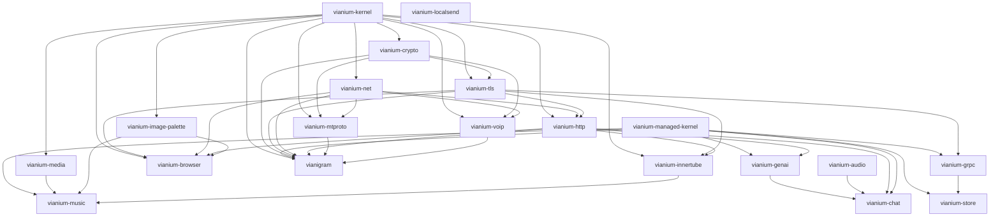

# Vianium Architecture Overview

Vianium is split into three repository tiers plus a meta tier, totaling
23 repositories (8 Tier 1, 8 Tier 2, 5 Tier 3, 2 Meta).

## Tiers

### Tier 1 — Foundation (Apache 2.0)

Stable, low-level building blocks. Some are native C++ for hot paths;
some are managed C# for SDK ergonomics. Native libraries that need to
be consumed from C# expose a WinRT projection. See
[ADR-0004](adr/0004-native-tls-winrt-projection.md).

| Repo | Language | Provides |
|---|---|---|
| `vianium-kernel` | C++ native | `Result<T>`, arena allocators, event bus, base types |
| `vianium-managed-kernel` | C# managed | `Result<T>`, base types and primitives for managed contexts |
| `vianium-crypto` | C++ native | SHA-1/256/512, HMAC, AES (CBC, GCM), BigNum, ECDH P-256 |
| `vianium-tls` | C++ native + WinRT projection | TLS 1.3 + TLS 1.2 with ALPN; Mozilla Modern policy, pinning, OCSP, CT |
| `vianium-net` | C++ native | TCP sockets, DNS, DNS-over-HTTPS |
| `vianium-http` | C++ native + WinRT projection | HTTP/1.1, HTTP/2, connection pool, HSTS, RFC 6455 WebSocket client |
| `vianium-grpc` | C# managed | gRPC framing, HPACK, HTTP/2 stream multiplexing; calls `vianium-tls` via WinRT |
| `vianium-audio` | C++/CX WinRT component | Real-time microphone capture and speaker playback (WASAPI), PCM resampling |

### Tier 2 — Domain protocols and libraries (Apache 2.0)

Domain-specific libraries built on the foundation.

| Repo | Language | Provides |
|---|---|---|
| `vianium-mtproto` | C++ native | Telegram MTProto 2.0 transport, TL schema layer 214 |
| `vianium-mtproxy` | C++ native + WinRT projection | MTProxy v2 obfuscated transport (legacy / secure / fake-TLS modes) |
| `vianium-voip` | C++ native | RTP, SRTP, OPUS, `libtgvoip` wrapper |
| `vianium-media` | C++/CX | Audio DSP (EQ, ReplayGain, FFT, crossfade), audio tag parser, FFmpeg interop |
| `vianium-image-palette` | C++/CX | Image color palette extraction for adaptive UI |
| `vianium-innertube` | C++/CX | YouTube Innertube API client |
| `vianium-store` | C# managed | Cloud Firestore client (98.9% Android SDK parity); generic name for future pluggable backends |
| `vianium-genai` | C# managed | Provider-neutral AI chat client (Gemini, OpenAI) — text, SSE streaming, and real-time Live voice sessions |

### Tier 3 — Products (PolyForm Noncommercial 1.0.0)

End-user products, all authored and maintained by **Angel Careaga**.

| Repo | Provides |
|---|---|
| `vianium-browser` | A clean-room native web browser |
| `vianigram` | A native Telegram client |
| `vianium-music` | A native music player with YouTube Music streaming |
| `vianium-localsend` | A LocalSend P2P file-sharing client for local networks |
| `vianium-chat` | A native multi-provider AI chat client (Gemini, ChatGPT) with text and real-time voice |

### Meta (Apache 2.0)

Cross-cutting documentation and templates.

| Repo | Provides |
|---|---|
| `vianium-docs` | Architecture, ADRs, policies, governance |
| `.github` | Org-level templates, security policy, profile page |

## Dependency flow



Arrow direction: `A --> B` means "A is used by B" (i.e. B depends on
A). Foundation repos point upward into the products that depend on
them.

## Repo-to-repo integration

Vianium repos integrate via relative path project references during
development. Each repo lives as a sibling under a common workspace
directory:

```text
workspace/
  vianium-kernel/
  vianium-managed-kernel/
  vianium-crypto/
  vianium-tls/
  vianium-net/
  vianium-http/
  vianium-grpc/
  vianium-audio/
  vianium-mtproto/
  vianium-voip/
  vianium-media/
  vianium-image-palette/
  vianium-innertube/
  vianium-store/
  vianium-genai/
  vianium-browser/
  vianigram/
  vianium-music/
  vianium-chat/
  vianium-docs/
```

Inside a consumer's `.vcxproj`:

```xml
<ProjectReference Include="..\vianium-kernel\Vianium.Core.Kernel.vcxproj" />
```

Inside a consumer's `.csproj`:

```xml
<ProjectReference Include="..\vianium-managed-kernel\Vianium.Managed.Kernel.csproj" />
```

This same pattern was used in the original monorepo setup; the
migration preserves it.

In the future, releases may also be consumed via NuGet (managed) or
binary artifacts attached to GitHub Releases (native). For
`vianium-store`, NuGet publication is planned from v0.1.0 because the
existing `.nuspec` is already prepared.

## Native and managed interop: WinRT projection

On Windows Phone 8.1, the supported way to expose a native C++ library
to managed C# code is via a Windows Runtime Component compiled as
C++/CX. This produces a `.winmd` metadata file that the C# compiler
reads to expose the native API as managed types — no P/Invoke needed.

For Vianium, the following native libraries ship with WinRT projections
that managed consumers can use directly:

- `vianium-tls` — consumed by `vianium-grpc` and through it by
  `vianium-store`
- `vianium-media` (already C++/CX) — projected naturally for
  `vianium-music`
- `vianium-image-palette` (already C++/CX) — projected for
  `vianium-music` and `vianium-browser` (favicon color extraction)
- `vianium-innertube` (already C++/CX) — projected for `vianium-music`

`vianium-kernel`, `vianium-crypto`, `vianium-net`, and `vianium-http`
are pure native C++ today. They gain a WinRT projection only when a
managed consumer needs one.

The projection lives inside the native repo as an additional
`.vcxproj` named `Vianium.Core.{Name}.WinRT.vcxproj`, keeping the
projected API in sync with the underlying implementation.

For the full rationale of preferring native TLS over a parallel managed
TLS implementation, see
[ADR-0004](adr/0004-native-tls-winrt-projection.md).

## Target platforms

The original consumers (`vianigram`, `vianium-browser`, `vianium-music`)
target **Windows Phone 8.1**, built with WinRT (C++/CX components plus a
managed C# layer), and run on **Windows 10 Mobile** as well. Every
design decision is validated against the low end of that hardware
range — 512 MB ARMv7 devices.

Foundation libraries are written in portable C++ 11/14 with no
WP8.1-specific constructs in core code paths, so they should be
reusable on other platforms after minimal porting work.
Platform-specific code is isolated.

`vianium-store`'s C# SDK targets WP8.1 today but the protocol layer
(gRPC, HTTP/2, Firestore) is platform-agnostic and could be ported to
.NET Standard or .NET 6+ later.

## Design principles

- **C++ over C# in hot paths.** Native code with arena allocators and
  zero-copy primitives for transport, parsing, crypto.
- **C# for SDK ergonomics.** Managed code for Firestore SDK, gRPC
  framing, product UI layer.
- **`Result<T>` over exceptions** in performance-critical paths
  (native and managed).
- **Clean-room implementation** for protocols (read the spec,
  implement from the spec).
- **No god objects.** Bounded contexts with explicit dependencies.
- **No singletons** for stateful services.
- **Capability-based dependency injection** from a manual composition
  root.
- **WinRT projection over P/Invoke** for native ↔ managed interop.
